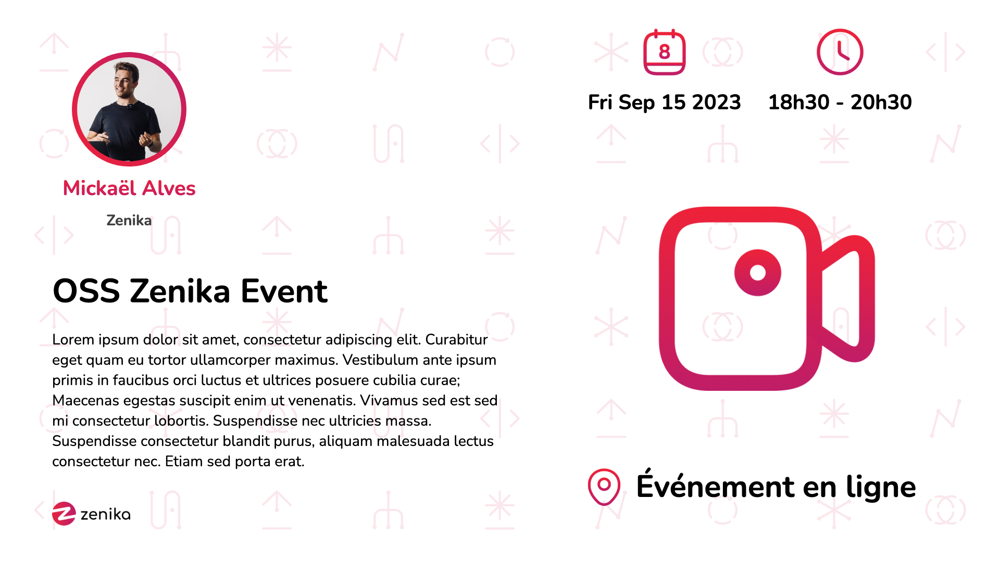
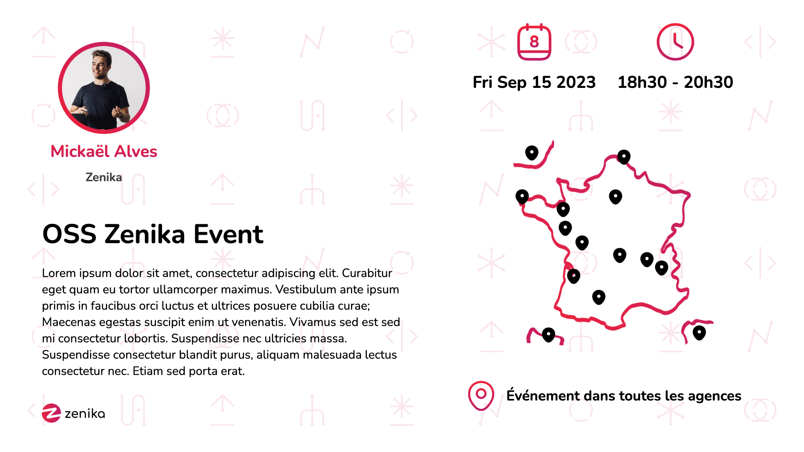
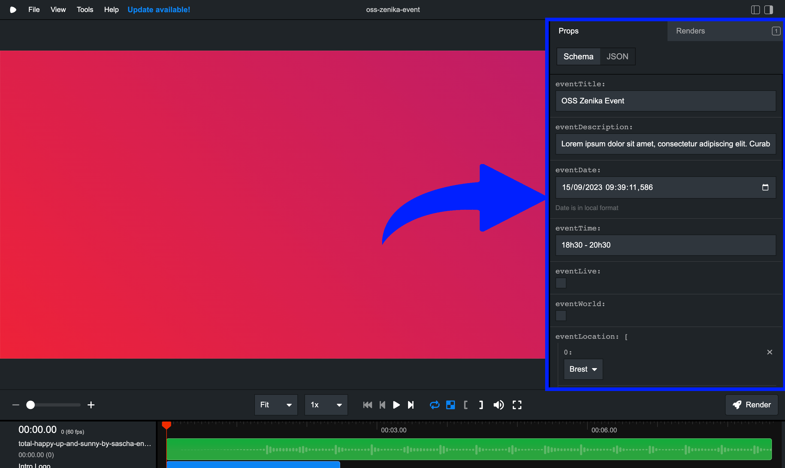
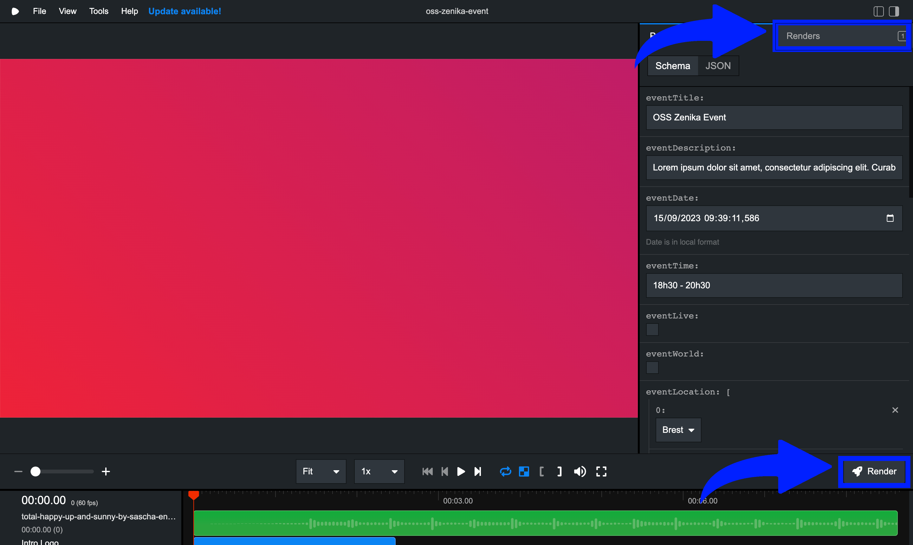

<h1 align="center">OOS Video Event Generator 🎞️</h1>
<br/>
<a href="https://github.com/remotion-dev/logo">
    
</a>
<br/>
<p align="center" style="font-weight: bold">Remotion-based tool designed to streamline the creation of compelling promotional videos for open-source events at Zenika 🎬</p>

## Commands 👨🏼‍💻

**Install Dependencies 📦**

```console
pnpm i
```

**Start Preview 👁️**

```console
pnpm start
```

**Render video 🏗️**

```console
pnpm build
```

**Upgrade Remotion 🆙**

```console
pnpm run upgrade
```

## Vidéo Details 📽️

**📐 Resolution :** 1920x1080 

**🖼 FPS :** 60

**⏱️ Duration :** 8.6s

**💻 Technologies :** 
- React
- Remotion
- Zod (https://zod.dev/)
- Typescript

## Video️ Props ⚙️

`eventTitle` 

Title of the event displayed on the second part of the video

`eventDescription` 

Event description displayed on the second part of the video, **The size of the text is fixed, so you have to pay attention to the length of the text so that everything fits in the video ⚠️**

`eventDate` 

Event date displayed on the second part of the video, with the format `DD/MM/YYYY`

`eventTime` 

Event timetable. Using a string gives you more freedom if you want to mark the start and/or end time. **Please note that the font size is fixed, so make sure that everything fits into the video ⚠️**

`eventLive` 

If the event is an online event. If this value is set to `true`, the video will display a "Live" icon on the second part of the video, and no agency will be listed.



`eventWorld` 

If the event concerns all agencies. This avoids having to indicate all the agencies in `eventLocation`. If this value is set to `true`, the video will display the map with **"Dans toutes les agences"** text.



`eventLocation` 

List of agencies concerned by the event. If `eventLive` & `eventWorld` is set to `false`. The video will display the map with selected agencies listed.

You can find the list of agencies in `src/data/agencies.ts`.

`eventLocationFontSize` 

You can adjust the font size of the agencies listed on the map with this value, depending on the number of agencies selected in `eventLocation`. **Please make sure that everything fits into the video ⚠️**

`speakers` 

List of speakers for the event. You can find the list of speakers in `src/data/speakers.ts`. For each speaker, you can specify the following properties:
- **name** 
- **company** 
- **picture** 

⚠️ **Most of the properties are optional, but be sure to check the display if you want to leave any fields empty.**

## How to render a video 🏗️

#### 1️⃣ Clone the repository
#### 2️⃣ Install dependencies with `pnpm i`
#### 3️⃣ Start the preview with `pnpm start`
#### 4️⃣ Customize the video props in the right panel. You can find the list of props above.



#### 5️⃣ Render the video using the `Render` button in the right panel. The video will be rendered in the `/out` folder and also on the `Renders` section in the right panel.




## Remotion Docs 📝

Get started with Remotion by reading the [fundamentals page](https://www.remotion.dev/docs/the-fundamentals) 📃

## Help 🆘

If you need help, please contact Mickaël Alves (@CruuzAzul) or the Zenika Open-Source team 💬